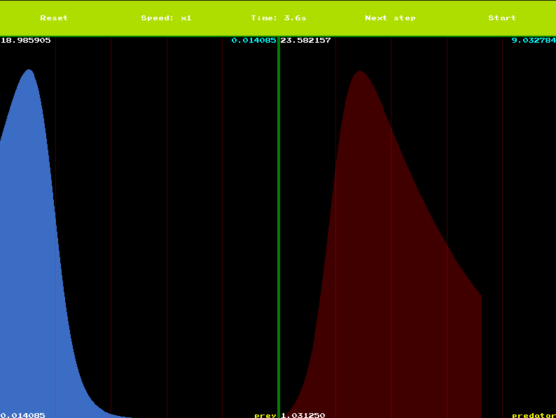
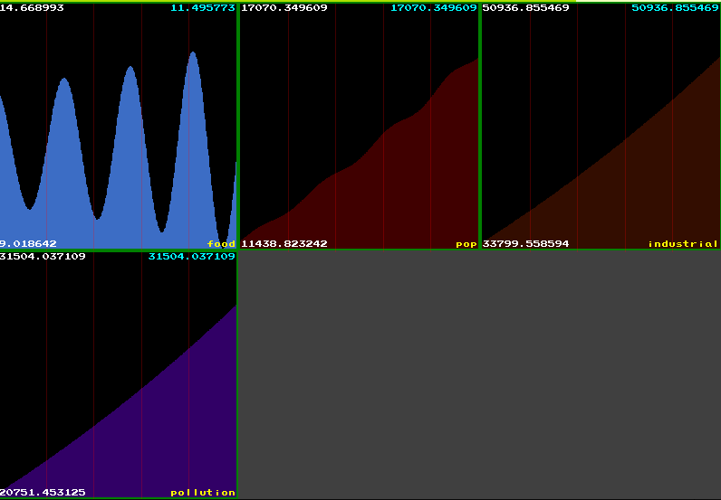

# models

An app to play around with differential equations and see the influence of retroaction loops.

# Installation

- Clone the repo: `git clone git@github.com:Knoblauchpilze/models.git`.
- Clone dependencies:
    * [core_utils](https://github.com/Knoblauchpilze/core_utils)
    * [maths_utils](https://github.com/Knoblauchpilze/maths_utils)
- Go to the project's directory `cd ~/path/to/the/repo`.
- Compile: `make run`.

Don't forget to add `/usr/local/lib` to your `LD_LIBRARY_PATH` to be able to load shared libraries at runtime. This is handled automatically when using the `make run` target (which internally uses the [run.sh](data/run.sh) script).

# General principle

This application is meant to explore the evolution of equation systems by applying numerical solving methods to a set of variables to see their evolution. The user can configure the simulation, the variables and their relation and see the result visually.

It is possible to load or save existing simulations and resume the computations later on.

The application is structured in different screens, each having its purpose:
* the home screen
* the load screen
* the simulation screen


# What is a simulation?

This application allows to simulate some equations system through numerical methods and then present a visualization of the results to the user in a nice way.

## What is a system of equations?

In the context of this app, we define a system of equations as a set of variables and the relations linking them together.

## What is a variable?

A variable is an atomic unit of the system and is basically just a name and a value. We distinguish between the initial value and the values at any point in the simulation. The initial value is used to seed the simulation and any further evolution is coming from this value.

We also allow the app to control the bounds for a variable. For example one can set a variable to only be in the positive range. Note finally that the ranges apply on the **variables' values** and not their **derivatives**.

## How does the app compute the variables?

Let's assume you want to represent the following equation and calculate the evolution of the value of `x`:

```
dx/dt = 2 * x
```

A way to do it would be as follows:
```cpp
float
calculateNextValue(float in, float dt) {
    const float derivative = 2.0f * in;
    return in + derivative * dt;
}
```

Now let's assume that you have a slightly more complex system, like the following:
```
dx/dt = 2 * x + y
dy/dt = -4 * x * y + 2
```

A way to compute the new values for both `x` and `y` would be:
```cpp
std::pair<float, float>
calculateNextValues(float inX, float inY, float dt) {
    const float dX = 2.0f * inX + inY;
    const float dY = -4.0f * inX * inY + 2.0f;

    return {
        inX + dX * dt,
        inY + dY * dt
    };
}
```

Already we can see some similarities between what happens for `x` and `y`. We have a set of relations which define how the derivative of `x` is linked to the other variables of the simulation (and possibly its value) and the same goes for `y`.

The first step is to compute the derivative of each variable: this allows to estimate how much of a change will be applied to the value of the variable in the next time step. Once this is done for all variables, we can deduce the next value by applying this derivative. This in turn gives the value for the next iteration.

What's left is to define a common approach to describe relations between variables.

## Defining an equation

Assuming that we have a list of variables with their initial values and a name, we can now define an equation: the equation for a single variable will govern how to compute its derivative at any point in time.

This is equivalent to the equation used previously and looks like so:
```
dy/dt = -4 * x * y + 2
```

In this case, assuming that we have only two variables (`x` and `y`), we need to building blocks to represent this equation:
* first, we need a way to represent a coefficient. The previous equation has two: `-4 * x * y` and `2`.
* second we need a way to have multiple such coefficients attached to a single variable.

### SingleCoefficient

This structure is defined as follows:
```cpp
struct VariableDependency {
    unsigned id;
    float n;
};

struct SingleCoefficient {
    float value;
    std::vector<VariableDependency> dependencies;
};
```

This allows to represent any coefficient which involved a constant part or a dependency on one or multiple variables.

So for example in the previous example, assuming that `x` is at index `0` and `y` is at index `1`, we can represent `-4 * x * y` like so:
```cpp
SingleCoefficient{-4.0f, {{0u, 1.0f}, {1u, 1.0f}}}
```

And `2` can be represented like so:
```cpp
SingleCoefficient{2.0f, {}}
```

Note that this system also allows to represent non-linear dependencies on variables. For example the following coefficient `3.2 * x ^ 6` can be represented like so:
```cpp
SingleCoefficient{3.2f, {{0u, 6.0f}}}
```

### A simple equation

Once we are able to represent individual components of a differential equation, representing the whole equation is pretty straightforward: we just need a collection of those, along with the information about the order of the equation.
```cpp
struct Equation {
    int order;
    std::vector<SingleCoefficient> coeffs;
};
```

The order allows to indicate how many integration step we need to make for each step of the simulation.

### A system of equations

In order to fully define a simulation, we now just have to combine the individual equations for each variable. Put together they allow to compute at each step of the simulation:
* first the derivatives for each variable.
* then the next step's value by adding the derivative to the current value according to the elapsed time.

This gives:
```cpp
using System = std::vector<Equation>;
```

### Notes and remarks

Note that for now we are only able to handle first order equations: we can't represent the second derivative or higher order derivatives.

It could be added by also providing some equations: it would just need to be added to the simulation loop.

# Load a game

From the main screen the user has the possibility to access to the list of simulations which were saved in the past and reload them.


The saved simulations are displayed and the user can click on one of them and they are then redirected to the main simulation screen.

## Save files

The save files are registered using a `.mod` extension and are a mix between human readable and binary data.

We use the model described in the simulation [secion](#what-is-a-simulation?) to represent the save files.

This leads to the following structure:

```
2
prey
15
RangeMin
RangeMax
_binary data_
predator
1
_binary data_
1
_binary data_
```

### Variables section

The first number corresponds to the number of variables in the simulation. This indicates to the parser how to interpret the rest of the file.

After that, each variable is laid out in the same way, described below:
* the first line indicates the name of the variable.
* the second line represents the initial value of the variable.
* the third and fourth line represent the range that this variable can take.
* the fifth line defines the equation to compute the derivative for this variable.

### The derivative equation

The derivative equation is stored in a binary form, using this semantic:
* first the number of coefficients contained in the equation.
* second the individual coefficients.

For the following paragraph, we will use an example coefficient of `-4 * x ^ 2 * y`. For each coefficient, this is how it looks:
* first the value of the coefficient (so for the example, it would be `4`).
* then the number of dependencies (in this case `2`).
* then each dependency, as the index of the variable it refers to (in this case first a `0` as the coefficient depends on variable `x` which is at index `0`, and then a `1` as the coefficient depends on variable `y` at index `1`) and the exponents in between the indices (in this case a `2` and then a `1`).

### Steps section

Once all the variables have been defined, the save file contains the simulation steps which already have been reached.

This section first defines how many steps are defined using a single integer. Then there are as many lines of binary data as steps.

Each line define in binary as many values as there are variables in the simulation. So for example in the previous example, each step line will contain two floating point values for the values of the two variables in the simulation.

# The simulation screen

When selecing the `New simulation` screen, the user enters the main screen of the application. This is where the simulation happens.


In this view, the user has access to a certain amount of controls to modify the way the simulation is running through a menu bar.

## How does this work?

The simulation is essentially a system of equations. These equations are usually defining dependent variables and one can from one specific state of the simulation compute the next values for each variable.

We define two main ways to make solve numerically the equations:
* The [Euler](https://en.wikipedia.org/wiki/Euler_method#Modifications_and_extensions) method: not very accurate but very fast.
* The [Runge-Kutta 4](https://fr.wikipedia.org/wiki/M%C3%A9thodes_de_Runge-Kutta#La_m%C3%A9thode_de_Runge-Kutta_classique_d'ordre_quatre_(RK4)) method (in **French**): more accurate but a bit longer.

Each of these method allows to compute numerically what will be the values of each variable involved in the simulation after a certain duration. This effectively enables to see the evolution of the system through time.

By default the simulation is configured so that the time delta between two consecutive states is `12.5ms`. When the simulation is running to its normal speed, the app tries to simulate `80` of these steps per second, which means that the simulation is running in real time. The user has the possibility to increase this speed by a certain factor.

The app runs the simulation in a dedicated thread, which means that the amount of time elapsed in it is precisely what we say it is.

## Controls


The `Reset` button allows to return the simulation to its initial state. This action can also be triggered by hitting the `R` key.

The `Speed` button allows to speed up the simulation by a certain factor. We allow `x2` up to `x32` speed. Note that increasing the speed makes the computation go faster but shouldn't result in a loss of precision in the simulation.

The `Time` displays the time elapsed since the beginning of the simulation in seconds. It is meant as a visual indicator of how long the simulation has been running.

The `Next step` button can be used to move one step ahead in the simulation. This only works if the simulation is not running already in the background. This action can also be triggered by hitting the `N` key.

The `Start` button allows to start a thread which will continuously run the simulation in the background and display the result in the main screen. As soon as the user presses this button, the text changes to `Pause` and another click on the button allows to stop the background simulation.

Additionally the user can choose to save the current simulation to a file by pressing the `S` key.

## Equation views

When the simulation is running, the app displays the values of each variable registered in the simulation in its dedicated visualiation widget.



The app tries to give as much space as possible to each variable while allocating an equal amount of space for each variable.

This is how it looks for 12 variables:

[](resources/equation_views_multi.png)

Each view contains all the information needed to interpret the value of the variable:
* by default, up to `400` values can be displayed
* on the top left, the maximum value is displayed. This is the maximum value of the whole displayed series
* on the bottom left, the minimum value is displayed. This is the minimum value of the whole displayed series
* on the top right (in cyan) the current value of the variable is displayed
* on the bottom right (in yellow) the name of the variable represented in the view is displayed
* a vertical line to give a sense of scale every 80 individual values

The color is chosen at random but is only picked so that it is darker enough to see the additional information in the view.

# A toy simulation

An attempt at a more realistic simulation is provided in the app by default. It's quite tricky to find meaningful coefficients like `birth_rate` or `pollution_death_factor`. It's tempting to put high enough values so that you have a fast evolution of elements, but it doesn't play nicely with the inherent exponential nature of certain processes.

For now the system is defined with four variables:
* food
* population
* industrial production
* pollution

We aso define control values for each variable:

## Food

```cpp
constexpr auto CROP_YIELD = 0.04f;
constexpr auto APPETITE = -0.1f;
constexpr auto ENVIRONMENTAL_DAMAGE = -0.01f;
```

The `CROP_YIELD` is linked to the industrial production and is meant to represent some sort of technological improvement which comes from the industry on the crops.

The `APPETITE` is linked to the population and represents the amount of food that is consumed by the population.

The `ENVIRONMENTAL_DAMAGE` is linked to the pollution and represents how much the pollution prevents the food from being accumulated. This could either be because of damaged goods or bad crops.

## Population.

```cpp
constexpr auto MORTALITY_RATE = -0.01f;
constexpr auto BIRTH_RATE = 0.015f;
constexpr auto POLLUTION_MORTALITY = -0.05f;
```

The `MORTALITY_RATE` is linked to the to the population and represents just how many people die from natural causes.

The `BIRTH_RATE` is linked to the population and the food and represents how many people are born at any point. It is also dependent on food so that the more food people have, the more likely they are to have children. This is an oversimplification of ho being well-fed is desirable.

The `POLLUTION_MORTALITY` is linked to pollution and represents how the damages to the environment can also have some consequences on people's health.

## Industrial production

```cpp
constexpr auto PRODUCTIVITY = 0.4f;
constexpr auto INDUSTRY_DEPRECATION = -0.001f;
constexpr auto MAINTENANCE_COST = -0.09f;
```

The `PRODUCTIVITY` is linked to the population and represent how many units of industrial products can be produced by people.

The `INDUSTRY_DEPRECATION` is linked to the industrial production and represents how many industrial equipments are going out of order because of their age.

The `MAINTENANCE_COST` is linked to the pollution and represents a factor which damages the industrial equipments due to pollution. It could represent the damages from storms, or due to generally operating in harsher conditions.

## Pollution

```cpp
constexpr auto POLLUTION_RATE = 0.05f;
constexpr auto PURGE_RATE = -0.05f;
```

The `POLLUTION_RATE` is linked to industrial production and represents how much pollution is produced to create the industrial equipments and the pollution that those equipments generate at any point.

The `PURGE_RATE` defines how fast the environment is able to cope with the pollution. It is not linked to any variable as it is most likely just a constant work that the environment is doing for free.

## Results

At first, the simulation is showing a growth in the population and a consumption of food.


After that, the industrial production helps increasing the food as well. The pollution is also steadily rising.


At some point we start noticing some cycles in the food production. It's not exactly clear why it's happening.


If we continue further, the cycles amplified and become unstable. We can see that the food situation also has some impact on the population growth. It never really stops but there are 'years' where the population almost doesn't grow.



After even more time we can see that the food situation doesn't stabilize and actually gets worse: there are moments where all the surplus is used, and this has a severe impact on the population growth.


What's happening as it seems is that in times where the population decreases a little, it's just enough considering the amoount of industrial production that there is to kick start a food stock again, which in turns allows the population to grow again.

It would be similar to say that this model ends up in a crises cycle where the poplulation is periodically starving before better days come again. It's a precarious system which seems to hold because of the industrial production and the increase in crop yield. It would be interesting to continue simulating a bit and depending on the coefficients between the impact of pollution on crops or of the industrial production on harvest which one would prevail.

## Extensions

The first thing that comes to mind is to refine the model in order to include more variables and better interactions.

The second thing would be to play a bit with the coefficients to find meaningful values based on reality.
